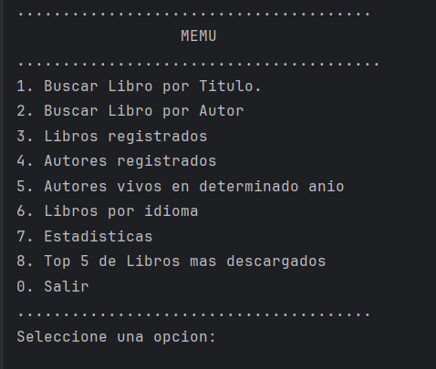
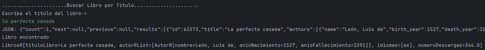
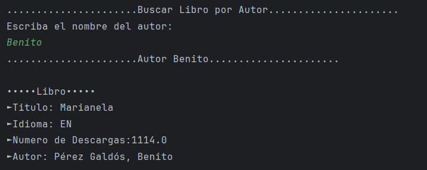
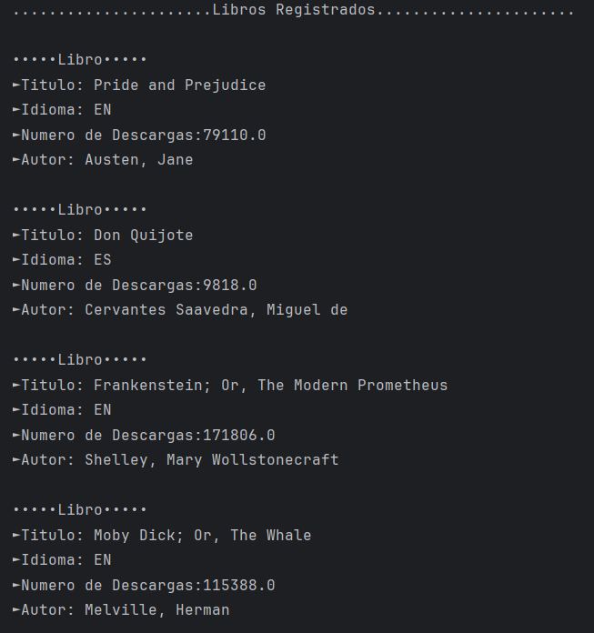
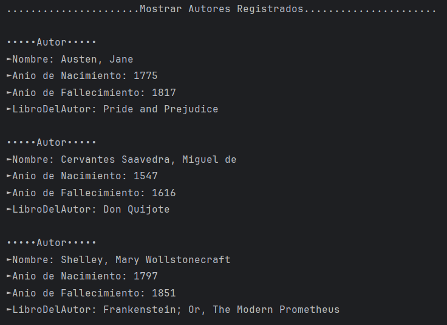
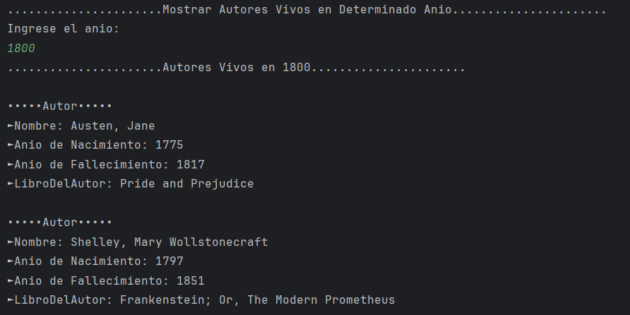
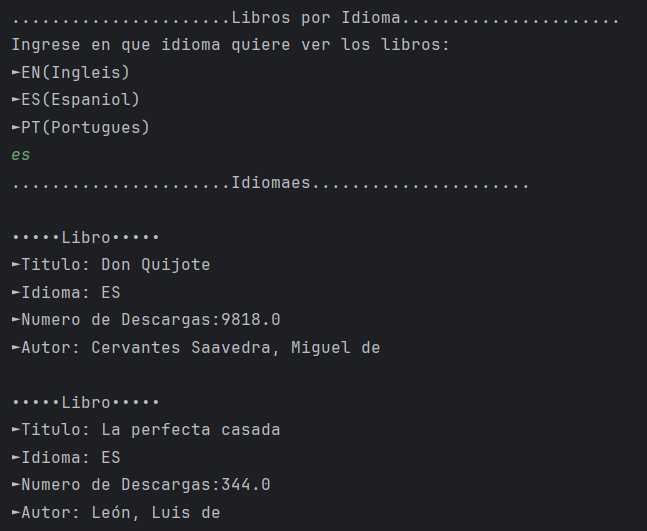
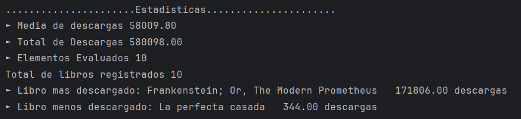
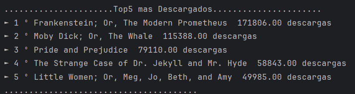

# 📚LiterAlura - Catálogo de Libros Interactivo


**Autor:** [@Gina-Alonso](https://github.com/Gina-Alonso)  
**BootCamp:** Oracle Next Education / Alura Latam
**Challenge:** LiterAlura  
**Fecha:** Diciembre 2025
## Acerca del Challenge
**LiterAlura** es una aplicación de consola en Java que permite explorar, buscar y gestionar un catálogo de libros obtenidos desde una API externa. Los usuarios pueden interactuar con el sistema mediante un menú textual con múltiples opciones.

## Características

- 🔍 Búsqueda de libros a través de API externa
- 💾 Almacenamiento local en base de datos
- 📊 Múltiples opciones de consulta
- 🖥️ Interfaz de consola 
- 📚 Gestión de autores y sus obras

## Tecnologías Utilizadas

- **Java 21+**
- **Spring Boot**
- **Base de datos PostgreSQL**
- **Jackson** para procesamiento JSON
- **JPA/Hibernate** para persistencia
- **API Gutendex** (API de libros gratuitos)

## Prerrequisitos

- JDK 21 o superior
- Maven 3.6+ o Gradle
- Conexión a Internet (para consumo de API)
- IDE de preferencia (IntelliJ IDEA)

## Instrucciones de Instalación

### 1. Clonar el Repositorio
```bash
git clone https://github.com/Gina-Alonso/Literatura.git
cd literalura
```
## Demostración de LiterAlura

### Pantalla del Menu


*Al ejecutar la aplicación, se muestra el menú principal*

### 1. Buscar libro


*Proceso de búsqueda y obtención desde Gutendex API el libro se almacena automáticamente en la BD*

### 2. Buscar libro por autor


*Proceso de busqueda del libro de un determinado autor desde la BD*

### 3. Libros Registrados


*Listado completo de los libros persistidos*

### 4. Libros Registrados


*Listado completo de autores persistidos*

### 5. Autores vivos en determinado anio


*Consulta de los autores en la BD*

### 6. Libros por idioma


*Consulta de libros por idioma*

### 7. Estadisticas


*Estadisticas*

### 8. Top 5 libros mas descargados

*Consulta de los 5 libros mas descargados*
